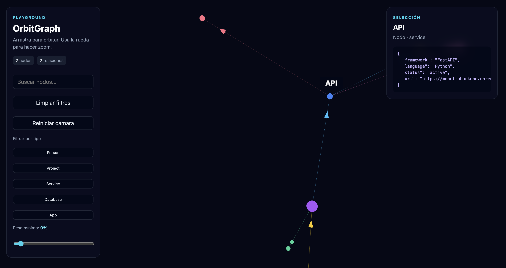

# OrbitGraph

OrbitGraph is a TypeScript library for exploring complex relationship graphs in 3D.

It renders nodes and directed relationships as an interactive WebGL universe. It is intended for user networks, services, documents, events, organizations, dependencies, and knowledge graphs.



## Features

- 3D force-directed graph layout
- Orbit, zoom, pan, drag, and pin nodes
- Directed links with arrows, colors, and weight-based opacity
- Node and relationship selection
- Hover labels and JSON metadata
- Search, multi-type filters, and minimum relationship weight
- Incremental node and relationship updates
- Vanilla JavaScript and React support

## Packages

| Package | Purpose |
| --- | --- |
| `@orbitgraph/core` | Graph types and data utilities |
| `@orbitgraph/three` | Three.js/WebGL renderer |
| `@orbitgraph/react` | React component bindings |

## Installation

### Vanilla JavaScript

```bash
npm install @orbitgraph/core @orbitgraph/three three
```

### React

```bash
npm install @orbitgraph/core @orbitgraph/three @orbitgraph/react three
```

## Quick start

```ts
import { createOrbitGraph } from "@orbitgraph/three";
import type { GraphData } from "@orbitgraph/core";

const data: GraphData = {
  nodes: [
    { id: "team", label: "Product Team", type: "group", color: "#22d3ee" },
    { id: "workspace", label: "Workspace", type: "resource", color: "#a855f7" }
  ],
  links: [
    { source: "team", target: "workspace", type: "manages", weight: 1 }
  ]
};

const container = document.querySelector<HTMLElement>("#graph");

if (!container) {
  throw new Error("Graph container was not found.");
}

const graph = createOrbitGraph(container);
graph.setData(data);
```

## Development

```bash
npm install
npm run typecheck
npm run test:run
npm run build
npm run dev
```

See `examples/vanilla` and `examples/react` for working consumer examples.

## Status

OrbitGraph is in early development.

## License

MIT