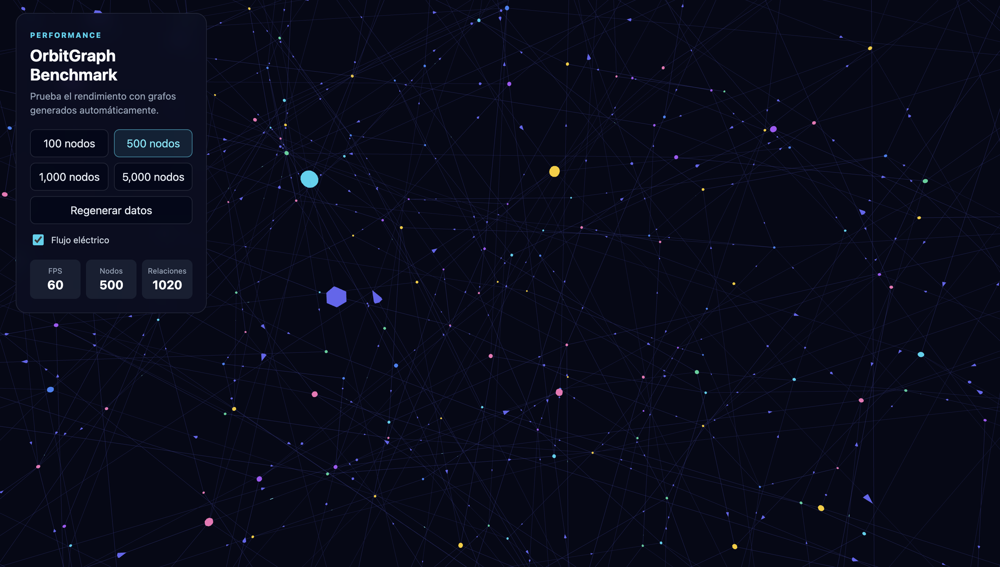

# OrbitGraph

> A TypeScript library for exploring complex relationship graphs in 3D.

OrbitGraph renders nodes and directed relationships as an interactive WebGL universe. It is built for networks of people, services, documents, events, organizations, dependencies, resources, and knowledge graphs.


## Start here

| I want to... | Go to |
| --- | --- |
| Install OrbitGraph and render my first graph | [Quick start](#quick-start) |
| Copy methods and configuration recipes | [API guide](./docs/api/README.md) |
| Start from a node, type, or neighborhood | [Relationship exploration](./docs/guides/relationship-exploration.md) |
| Learn the data model | [Getting started](./docs/guides/getting-started.md) |
| Measure large graph performance | [Performance guide](./docs/guides/performance.md) |
| Run complete applications | [Examples](#examples) |

## Features

- 3D force-directed graph layout
- Orbit, zoom, pan, drag, and pin nodes
- Directed relationships with arrows, colors, and weight-based opacity
- Optional animated energy flow along relationships
- Node and relationship selection with hover labels and JSON metadata
- Search, multi-type filters, and minimum relationship weight
- Progressive exploration with `initialView`, expansion, and collapse controls
- Incremental graph updates
- Vanilla JavaScript and React support

## Packages

| Package | Purpose |
| --- | --- |
| [`@orbitgraph/core`](https://www.npmjs.com/package/@orbitgraph/core) | Graph types and data utilities |
| [`@orbitgraph/three`](https://www.npmjs.com/package/@orbitgraph/three) | Three.js/WebGL renderer |
| [`@orbitgraph/react`](https://www.npmjs.com/package/@orbitgraph/react) | React component bindings |

## Requirements

- Node.js 18 or newer
- Modern browser with WebGL support
- Three.js `^0.185.0`
- React 18 or 19 for `@orbitgraph/react`

## Installation

### Vanilla JavaScript

```bash
npm install @orbitgraph/core @orbitgraph/three three
```

### React

```bash
npm install @orbitgraph/core @orbitgraph/three @orbitgraph/react three
```

## Quick start

```html
<div id="graph" style="width: 100vw; height: 100vh"></div>
```

```ts
import { createOrbitGraph } from "@orbitgraph/three";
import type { GraphData } from "@orbitgraph/core";

const data: GraphData = {
  nodes: [
    {
      id: "team",
      label: "Product Team",
      type: "group",
      color: "#22d3ee",
    },
    {
      id: "workspace",
      label: "Workspace",
      type: "resource",
      color: "#a855f7",
    },
  ],
  links: [
    {
      source: "team",
      target: "workspace",
      type: "manages",
      weight: 1,
    },
  ],
};

const container = document.querySelector<HTMLElement>("#graph");

if (!container) {
  throw new Error("Graph container was not found.");
}

const graph = createOrbitGraph(container, {
  linkFlow: {
    enabled: true,
    maxParticles: 140,
    particleSize: 0.09,
    particleSpeed: 0.12,
  },
});

graph.setData(data);
```

For the complete method reference, options, filters, events, React usage, and exploration recipes, see the [API guide](./docs/api/README.md).

## Explore large graphs progressively

Do not render everything when users only need one part of a large network.

```ts
const graph = createOrbitGraph(container, {
  initialView: {
    mode: "type",
    nodeType: "group",
    maxNodes: 100,
  },
});

graph.setData(data);

graph.expandNode("team", {
  depth: 1,
  direction: "outgoing",
});
```

The full source data remains available in memory, but nodes outside the active exploration are not mounted in the renderer or force simulation. Read the [relationship exploration guide](./docs/guides/relationship-exploration.md) for `all`, `node`, `neighborhood`, `type`, expansion, collapse, and reset behavior.

## Benchmark

OrbitGraph includes an interactive benchmark for generated graphs with 100, 500, 1,000, and 5,000 nodes.



It displays FPS plus node and relationship totals, and lets you compare optional energy flow against performance.

```bash
npm run build
npm run dev:benchmark
```

Open the local Vite URL, usually `http://localhost:5173`.

For interpretation and performance guidance, see [Performance](./docs/guides/performance.md).

## Examples

| Example | What it demonstrates |
| --- | --- |
| [`examples/vanilla`](./examples/vanilla) | Direct browser integration with TypeScript |
| [`examples/react`](./examples/react) | OrbitGraph mounted as a React component |
| [`examples/benchmark`](./examples/benchmark) | Generated large graphs and FPS comparison |

## Development

```bash
npm install
npm run typecheck
npm run test:run
npm run build
npm run dev
```

## Documentation map

```text
README.md                         Start here
docs/api/README.md                Copy-and-use API reference
docs/guides/getting-started.md    Data model and first graph
docs/guides/relationship-exploration.md
                                  Progressive exploration behavior
docs/guides/performance.md        Benchmark and performance guidance
examples/                         Runnable consumer applications
```

## Status

OrbitGraph is under active development. The public API is documented and tested; review the [Roadmap](./ROADMAP.md) for planned enhancements.

## License

MIT