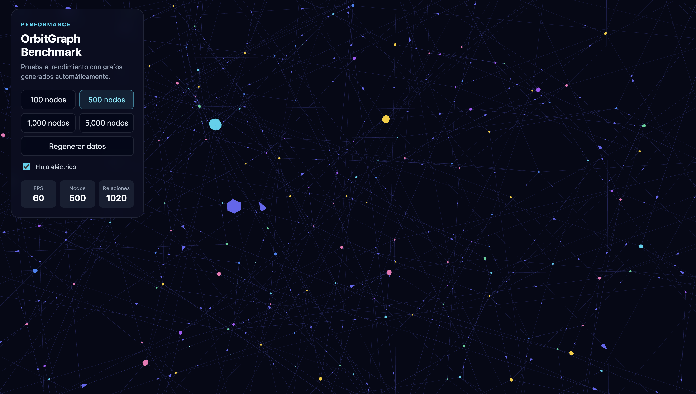

# OrbitGraph

> Explore connected data in 3D — start small, follow relationships, and reveal only what matters.


OrbitGraph is a TypeScript library for interactive 3D relationship graphs. Version 1.2 adds background physics workers, graph analytics, GraphQL data loading, and structured diagnostics alongside progressive exploration, React, accessibility, and exports.

## Install

```bash
npm install @orbitgraph/core @orbitgraph/three three
```

<details>
<summary><strong>Using React?</strong></summary>

```bash
npm install @orbitgraph/core @orbitgraph/three @orbitgraph/react three
```

</details>

---

## 1. Create a graph

```html
<div id="graph" style="width: 100vw; height: 100vh"></div>
```

```ts
import { createOrbitGraph } from "@orbitgraph/three";
import type { GraphData } from "@orbitgraph/core";

const container = document.querySelector<HTMLElement>("#graph");

if (!container) {
  throw new Error("Graph container was not found.");
}

const graph = createOrbitGraph(container, {
  backgroundColor: "#050816",
});
```

---

## 2. Add your data

```ts
const data: GraphData = {
  nodes: [
    {
      id: "design-team",
      label: "Design Team",
      type: "team",
      color: "#22d3ee",
      data: { region: "North" },
    },
    {
      id: "workspace",
      label: "Workspace",
      type: "resource",
      color: "#a855f7",
    },
    {
      id: "notifications",
      label: "Notifications",
      type: "service",
      color: "#3b82f6",
    },
  ],
  links: [
    {
      source: "design-team",
      target: "workspace",
      type: "manages",
      weight: 1,
    },
    {
      source: "workspace",
      target: "notifications",
      type: "uses",
      weight: 0.8,
    },
  ],
};

graph.setData(data);
```

Each node and relationship can contain JSON-compatible metadata in `data`.

---

## 3. Choose where exploration starts

Use `initialView` when the complete graph would be too large or too noisy.

| Start with | Configuration |
| --- | --- |
| Everything | `all` |
| One known entity | `node` |
| One entity and its connections | `neighborhood` |
| A category of entities | `type` |

```ts
const graph = createOrbitGraph(container, {
  initialView: {
    mode: "neighborhood",
    nodeId: "design-team",
    depth: 1,
    direction: "outgoing",
  },
});
```

> Nodes hidden by exploration are not mounted in WebGL or the force simulation. This keeps large graphs responsive from the first render.

---

## 4. Explore relationships

```ts
graph.expandNode("design-team", {
  depth: 1,
  direction: "outgoing",
  relationshipTypes: ["manages", "owns"],
  limit: 25,
  offset: 0,
});

graph.collapseNode("design-team");
graph.resetExploration();
graph.showAll();
```

Search and filters refine only the explored subset; they never reveal data that exploration is still hiding.

```ts
graph.search("workspace");
graph.toggleTypeFilter("service");
graph.setMinimumLinkWeight(0.7);
graph.clearFilters();
```

---

## 5. Load data on demand

`GraphDataSource` allows an application to fetch nodes and relationship pages only when the user needs them.

```ts
import type { GraphDataSource } from "@orbitgraph/core";

const dataSource: GraphDataSource = {
  async getNode(nodeId) {
    const response = await fetch(`/api/nodes/${nodeId}`);

    if (!response.ok) {
      throw new Error("Unable to load the node.");
    }

    return response.json();
  },
  async getNeighborhood({ nodeId, limit = 50, offset = 0 }) {
    const response = await fetch(
      `/api/nodes/${nodeId}/neighborhood?limit=${limit}&offset=${offset}`,
    );

    if (!response.ok) {
      throw new Error("Unable to load the neighborhood.");
    }

    return response.json();
  },
};

const graph = createOrbitGraph(container, { dataSource });

await graph.loadNode("design-team");
await graph.loadNeighborhood("design-team", {
  direction: "outgoing",
  limit: 50,
});
```

### GraphQL

Use the optional GraphQL adapter when your backend exposes GraphQL. OrbitGraph does not require Apollo, urql, Relay, or another GraphQL client.

```ts
import {
  createGraphQLDataSource,
  createOrbitGraph,
} from "@orbitgraph/three";

const dataSource = createGraphQLDataSource({
  endpoint: "/graphql",
  getNode: {
    document: `query Person($id: ID!) {
      person(id: $id) { id label type }
    }`,
    variables: (id) => ({ id }),
    select: (data) => data.person ?? undefined,
  },
  getNeighborhood: {
    document: `query Neighborhood($nodeId: ID!, $limit: Int, $offset: Int) {
      neighborhood(nodeId: $nodeId, limit: $limit, offset: $offset) {
        nodes { id label type }
        links { id source target type weight }
        hasMore
        nextOffset
      }
    }`,
    variables: ({ nodeId, limit, offset }) => ({ nodeId, limit, offset }),
    select: (data) => data.neighborhood,
  },
});

const graph = createOrbitGraph(container, { dataSource });
```

See [Data sources](./docs/data-sources.md) for REST, GraphQL, pagination, and custom-client examples.

---

## 6. Handle loading and diagnostics

OrbitGraph exposes loading state for UI and diagnostics for logs or monitoring. It does not render error UI itself.

```ts
const graph = createOrbitGraph(container, {
  dataSource,
  onLoadingChange: (state) => {
    if (state.loading) {
      console.log(`Loading ${state.operation}: ${state.nodeId}`);
    }

    if (state.error) {
      console.error(state.error.message);
    }
  },
  onDiagnostic: (diagnostic) => {
    console.error(`[${diagnostic.code}] ${diagnostic.message}`);
  },
});
```

Remote requests also reject normally, so application code can use `try/catch` to implement retries or custom recovery.

---

## 7. Add optional relationship flow

```ts
const graph = createOrbitGraph(container, {
  linkFlow: {
    enabled: true,
    maxParticles: 140,
    particleSize: 0.09,
    particleSpeed: 0.12,
  },
});
```

Keep it disabled when rendering the largest graphs.

---

## 8. Analytics

Analytics operate on all loaded data by default. Pass `{ scope: "visible" }` to analyze the currently explored and filtered view.

```ts
const degree = graph.analytics.degree();
const rank = graph.analytics.pageRank({ scope: "visible" });
const betweenness = graph.analytics.betweenness();

const communities = await graph.analytics.detectCommunitiesAsync({
  scope: "visible",
  weighted: true,
});
```

---

## 9. Keep large graphs responsive

OrbitGraph can run force physics in a module Web Worker, keeping the browser UI responsive while large graphs settle.

```ts
const graph = createOrbitGraph(container, {
  physics: {
    worker: true,
    tickRate: 60,
  },
});
```

The worker is used for force-directed layouts. Deterministic `radial`, `grid`, and `hierarchical` layouts are calculated directly because they do not need continuous simulation.

---

## 10. Export and camera

```ts
await graph.downloadPNG("relationship-map.png");
graph.downloadJSON({ scope: "visible", fileName: "visible-graph.json" });

graph.focusNode("workspace");
graph.resetCamera();
graph.unpinNode("workspace");
```

Keyboard navigation and mobile touch controls are available by default and can be configured through `accessibility`, `camera`, and `mobile` options.

---

## React

```tsx
import { OrbitGraph } from "@orbitgraph/react";

export function App() {
  return (
    <OrbitGraph
      data={data}
      style={{ width: "100%", height: "100vh" }}
      options={{ dataSource }}
      onLoadingChange={(state) => {
        if (state.error) {
          console.error(state.error.message);
        }
      }}
      onDiagnostic={(diagnostic) => {
        console.error(diagnostic);
      }}
    />
  );
}
```

---

## Benchmark

OrbitGraph includes an interactive benchmark for generated graphs of 100 to 10,000 nodes.



```bash
npm install
npm run build
npm run dev:benchmark
```

---

## Documentation

- [API reference](./docs/api/README.md)
- [Data sources and diagnostics](./docs/guides/data-sources.md)
- [Performance notes](./docs/guides/performance.md)
- [Getting started](./docs/guides/getting-started.md)

## Development

```bash
npm install
npm run typecheck
npm run test:run
npm run build
```

See `examples/vanilla`, `examples/react`, and `examples/benchmark` for working examples.

## License

MIT
