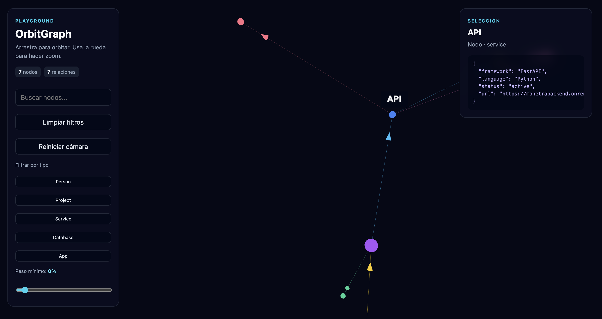

# OrbitGraph

> Explore connected data in 3D — load only what matters, reveal relationships progressively, and explain the structure visually.



OrbitGraph is a TypeScript library for interactive relationship graphs. It combines Three.js rendering, force-directed layouts, progressive exploration, analytics, remote data loading, and React bindings in a small set of focused packages.

## Install

```bash
npm install @orbitgraph/core @orbitgraph/three three
```

<details>
<summary><strong>Using React?</strong></summary>

```bash
npm install @orbitgraph/core @orbitgraph/three @orbitgraph/react three
```

</details>

## Start with a useful view

```ts
import { createOrbitGraph } from "@orbitgraph/three";
import type { GraphData } from "@orbitgraph/core";

const data: GraphData = {
    nodes: [
        { id: "team", label: "Product Team", type: "team", color: "#22d3ee" },
        { id: "api", label: "Public API", type: "service", color: "#3b82f6" },
    ],
    links: [
        { id: "team-owns-api", source: "team", target: "api", type: "owns", weight: 0.95 },
    ],
};

const container = document.querySelector<HTMLElement>("#graph");

if (!container) {
    throw new Error("Graph container was not found.");
}

const graph = createOrbitGraph(container, {
    initialView: { mode: "node", nodeId: "team" },
    labels: {
        mode: "important",
        importantNodeIds: ["team"],
        showNodeType: true,
    },
    miniMap: {
        enabled: true,
        interactive: true,
    },
});

graph.setData(data);
graph.expandNode("team", { direction: "outgoing" });
```

Hidden nodes are kept out of WebGL and the active physics simulation until exploration reveals them.

## What OrbitGraph includes

- 3D force-directed, radial, grid, and hierarchical layouts.
- Progressive exploration from a node, neighborhood, or node type.
- Local search, type filters, link-weight filters, history, and path focus.
- Worker-backed physics with automatic main-thread fallback.
- Optional remote loading through `GraphDataSource` and a GraphQL adapter.
- Degree, PageRank, betweenness, and community detection.
- Visual presentation APIs for analytics: color, scale, glow, and legends you control.
- Intelligent persistent labels, hover labels, and an interactive mini-map.
- Desktop keyboard movement, keyboard graph navigation, touch controls, and mobile controls.
- Node/link events, selection, diagnostics, loading state, PNG export, JSON export, and view-state persistence.
- Automatic community colors with collapsible clusters, advanced metadata filters, and shareable views.
- Bookmarks and serializable annotations for application-managed collaboration.
- CSV, Cytoscape, JSON-LD, and Neo4j import helpers, plus timeline, bipartite, geographic, DAG, and Sankey layouts.
- Application-owned tooltip/detail renderers, semantic node list, adaptive label detail, and optional FPS telemetry.
- Vanilla JavaScript and React support.

## Packages

| Package | Purpose |
| --- | --- |
| [`@orbitgraph/core`](./packages/core) | Data types, analytics, communities, and data-source contracts. |
| [`@orbitgraph/three`](./packages/three) | Three.js renderer and imperative graph API. |
| [`@orbitgraph/react`](./packages/react) | React component and ref-based actions. |

## Explore and analyze

```ts
const pageRank = graph.analytics.pageRank({ scope: "visible" });

graph.presentation.setNodeStyles({
    "api": {
        color: "#facc15",
        scale: 1.6,
        glow: 0.9,
    },
});

const communities = await graph.analytics.detectCommunitiesAsync({
    scope: "visible",
    weighted: true,
});
```

Analytics calculate data; they never change your graph automatically. Your application decides how results should appear.

## Collaborative exploration and large graphs

```ts
const clusters = graph.clusterCommunities();
graph.collapseCluster(clusters[0].id);
graph.expandCluster(clusters[0].id);

graph.setAdvancedFilters({
    minimumLinkWeight: 0.5,
    attributes: [{ field: "status", operator: "equals", value: "production" }],
});

const urlState = graph.shareView();
graph.addAnnotation({
    id: "note-api",
    target: { kind: "node", nodeId: "api" },
    body: "Review ownership before launch.",
    createdAt: new Date().toISOString(),
});
graph.saveBookmark("launch-review", "Launch review");
```

Use `accessibility: { semanticView: true }` to render a synchronized semantic node list. `performance: { telemetry: true, onPerformanceSample }` reports FPS and visible graph counts; labels automatically reduce to 20 items above 1,000 visible nodes unless `levelOfDetail: false` is set.

## Remote data

```ts
const graph = createOrbitGraph(container, {
    dataSource: {
        async getNode(nodeId) {
            return fetch(`/api/nodes/${nodeId}`).then((response) => response.json());
        },
        async getNeighborhood({ nodeId, limit = 25, offset = 0 }) {
            return fetch(`/api/nodes/${nodeId}/neighbors?limit=${limit}&offset=${offset}`)
                .then((response) => response.json());
        },
    },
});

await graph.loadNeighborhood("team", { limit: 25, offset: 0 });
```

## Documentation

- [Complete API reference](./docs/api/API.md)
- [Core package documentation](./packages/core/README.md)
- [Three.js package documentation](./packages/three/README.md)
- [React package documentation](./packages/react/README.md)
- [Changelog](./CHANGELOG.md)
- [Contributing](./CONTRIBUTING.md)

## Examples

```bash
npm install
npm run dev:vanilla
npm run dev:react
npm run dev:benchmark
```

The Vanilla and React examples demonstrate remote relationship pages, analytics, community visualization, labels, mini-map navigation, selection details, loading states, diagnostics, and exports.

## Development

```bash
npm run typecheck
npm run test:run
npm run build
```

## License

MIT
